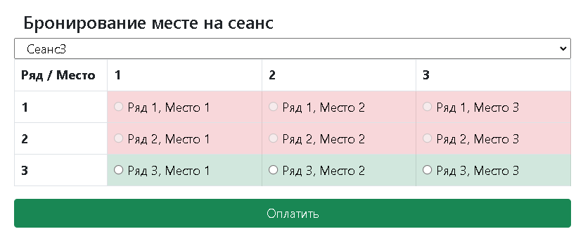

# job4j_cinema

Description :
- This project represent ticket purchase web-service

Used technologies:
- Java Servlet API
- PostgreSQL
- Apache Commons DBCP 
- Apache Commons DbUtils 
- Lombok 
- JSON (GSON)